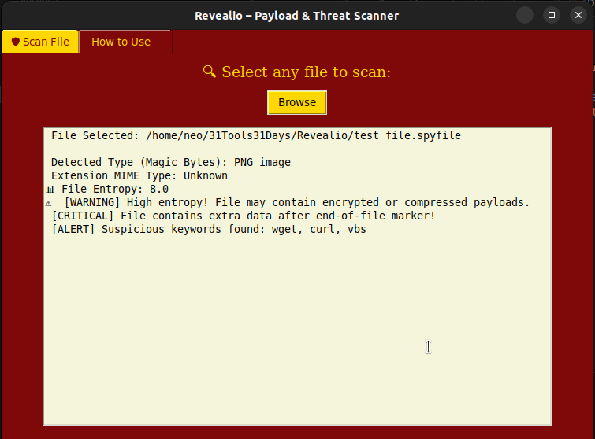
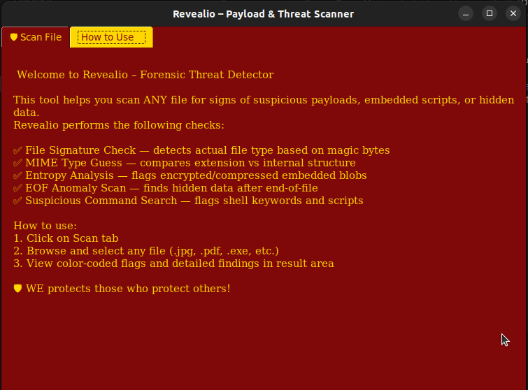
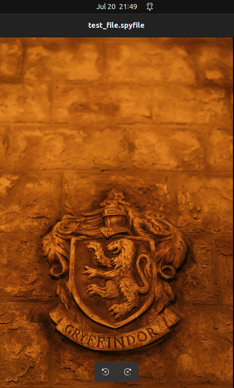

# 🛡️ Revealio v2 — Gryffindor’s Threat Scanner

> _“It is our choices, Harry, that show what we truly are — far more than our abilities.”_  
> — **Albus Dumbledore**

When attackers hide malware inside innocent-looking cat memes, PDF resumes, or free software tools, **Revealio** helps you choose to defend.

---

## 🔍 What is Revealio?

**Revealio** is a forensic-grade, Gryffindor-themed desktop tool that scans *any file* for:

- hidden payloads  
- suspicious shell commands  
- EOF-based implants  
- and file extension mismatches (aka magic byte mismatches)

Whether it's a `.jpg`, `.pdf`, `.exe`, or `.zip`, Revealio can sniff out the deception beneath.

---

## 🎯 Features

| Feature                                     | Description                                                                                  |
|--------------------------------------------|----------------------------------------------------------------------------------------------|
| 🧪 **Universal File Scanner**              | Accepts all file types — `.jpg`, `.png`, `.pdf`, `.docx`, `.exe`, `.zip`, `.mp3`, etc.       |
| 🔬 **Magic Byte & MIME Type Analysis**     | Detects if file content doesn't match its extension (e.g. `.png` that’s secretly a `.zip`)   |
| 📈 **Entropy Scanner**                     | Flags suspiciously **high-entropy segments** (indicates encrypted/packed data)               |
| 🧨 **EOF Payload Detection**               | Detects extra data hidden **after the legitimate end-of-file marker**                        |
| 📜 **Suspicious Shell & Payload Strings**  | Flags embedded keywords like `curl`, `nc`, `powershell`, `mshta`, `dropper`, etc.            |
| 🚦 **Severity Levels**                     | Clear labels: `✅ SAFE`, `⚠️ WARNING`, `🔴 CRITICAL`, `🛑 ALERT`                               |
| 🎨 **Gryffindor-Themed GUI**               | Red & Gold interface + magical fonts + onboarding tab for new users                          |

---

## 🖼️ GUI Preview

- 📂 Browse → select file  
- 🛡️ Click “Scan”  
- ✅ View results with severity-based tags

No terminal needed. No internet needed. Everything runs locally.

---

## 🧰 Tech Stack

- `Python` + `tkinter` for GUI  
- `mimetypes`, `os`, `math`, `re`, `base64`, `pathlib` for logic  
- Zero external dependencies (unless tkinter missing)

---

## ⚙️ Installation

### 1. Clone this repo:
```bash
git clone https://github.com/yourusername/revealio
cd revealio
```

## Testing Tips

You can create your own "suspicious" files:

EOF Payload Test:
``` bash
echo "hidden_payload" >> test.jpg
```

Fake Extension Test:
``` bash
cp sample.exe fake.pdf
```

High Entropy File:
```bash
openssl rand 2048 > encrypted.bin
```

## Screenshots

> 

> 

> 

> 


